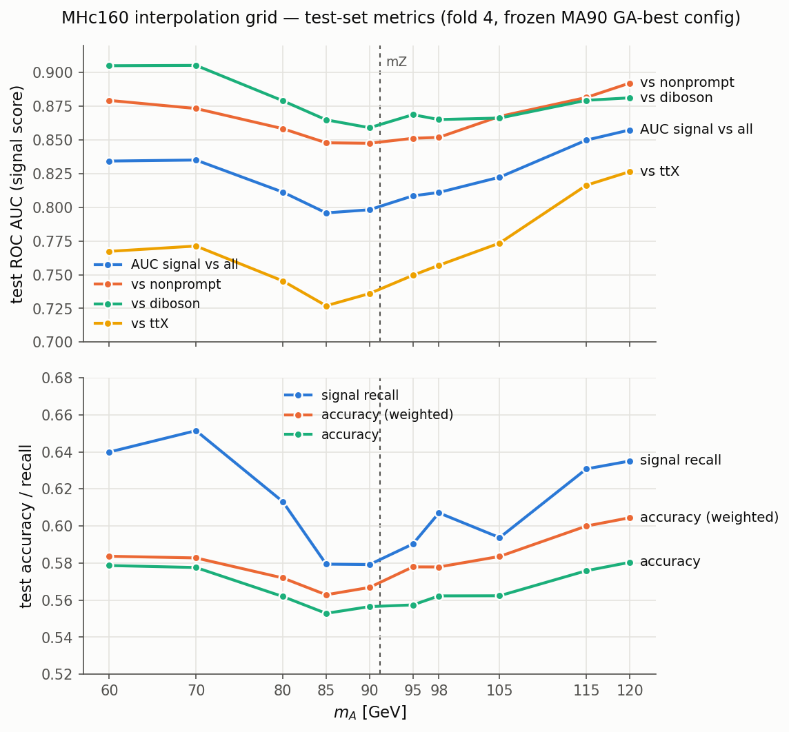

# Mass Interpolation Feasibility Study (MHc160 grid)

**Status:** feasibility test — results live in `InterpolationTest/` and are NOT analysis inputs.
**Date:** 2026-07-29

## Purpose

Test whether ParticleNetMD classifiers behave smoothly as a function of the pseudoscalar
mass mA, i.e. whether models (or their scores) can be interpolated to mass points without
a dedicated per-point GA optimization. The probe: train **ten mass points**
(mHc = 160 GeV, mA = 60–120 GeV) with a **single frozen hyperparameter set** and check
that performance varies smoothly and remains close to per-point optima.

## Setup

### Frozen configuration

All points use `InterpolationTest/configs/SglConfig.json` — a copy of `configs/SglConfig.json`
with the **MHc160_MA90 GA-best chromosome** substituted
(source: `GAOptim/Combined/MHc160_MA90/fold-4/best_model/model_info.json`):

| parameter | value |
|---|---|
| nNodes | 256 |
| optimizer | Adam |
| initLR | 3e-4 |
| weight_decay | 1.7e-4 |
| scheduler | ExponentialLR |
| disco_lambda | 0.1 (fixed, no sweep) |
| max_epochs / batch / dropout | 120 / 512 / 0.4 |
| folds | train [0,1,2] / valid [3] / test [4] |
| max_events_per_fold_per_class | 50000 |
| output_config.results_dir | `InterpolationTest` |

Training command (per point):

```bash
python python/trainMultiClass.py --signal MHc160_MA{ma} --channel Combined \
    --config InterpolationTest/configs/SglConfig.json
```

Visualization (uses the `--base-dir` flag added to `visualizeMultiClass.py`,
default `LambdaSweep` unchanged):

```bash
python python/visualizeMultiClass.py --signal MHc160_MA{ma} --channel Combined \
    --base-dir InterpolationTest --fold 4 --model-name discoL0p1
```

### Dataset format migration (2026-07-29)

The pre-existing `.pt` datasets were a stale snapshot: 4-dim `graphInput`, a `has_bjet`
attribute, old WZ/TTZ sample naming, and only 1 of 9 TTLL variants. They were incompatible
with both current `saveDataset.py` (8-dim era one-hot) and the GA models
(`num_graph_features: 8`). Mixing formats crashes PyG collation.

Regenerated in the current format from `SKNanoOutput/EvtTreeProducer/`:

- Signals: MHc160_MA{60,70,80,85,90,95,98,105,115,120} + baselines
  (MHc100_MA95, MHc115_MA87, MHc130_MA90, MHc145_MA92). `MHc130_MA100` left old-format.
- All 13 backgrounds (9 TTLL variants, era-merged `Skim_TriLep_WZTo3LNu` / `Skim_TriLep_TTZ`,
  `ZZTo4L_powheg`, `tZq`).
- Old files preserved in `BackUps/dataset_oldformat_20260729/`.

Event-count check: every grid point exceeds the 50k/fold Combined training cap except
MA60 (~45.6k/fold, a 9% deficit; `balance_weights` compensates). mA = 80/105/115/120
EvtTreeProducer samples were produced mid-study; there is no MHc160_MA100 sample (it is MA105).

## Validation of the pipeline (MA90 anchor)

Retraining MA90 with the frozen config on the regenerated dataset reproduces the GA
reference within 0.3%:

| metric | InterpolationTest | GA best_model |
|---|---|---|
| best valid loss | 0.66246 | 0.66054 |
| best valid acc | 0.58985 | 0.58902 |
| best epoch | 116/120 | 117/120 |

The residual ~+0.002 loss offset is the dataset-snapshot/code-path difference and is used
below to calibrate cross-config comparisons.

## Results

### Training summary (valid set, fold 3)

| point | best epoch | valid loss | valid acc | CE@best | DisCo@best |
|---|---:|---:|---:|---:|---:|
| MA60 | 117 | 0.66679 | 0.6064 | 0.5952 | 0.7162 |
| MA70 | 118 | 0.65932 | 0.6059 | 0.5963 | 0.6305 |
| MA80 | 118 | 0.65938 | 0.5985 | 0.6077 | 0.5168 |
| MA85 | 94 | 0.67298 | 0.5848 | 0.6268 | 0.4615 |
| MA90 | 116 | 0.66246 | 0.5899 | 0.6190 | 0.4342 |
| MA95 | 113 | 0.65920 | 0.5930 | 0.6143 | 0.4490 |
| MA98 | 116 | 0.66083 | 0.5937 | 0.6129 | 0.4794 |
| MA105 | 119 | 0.65994 | 0.5986 | 0.6069 | 0.5307 |
| MA115 | 119 | 0.64867 | 0.6127 | 0.5865 | 0.6213 |
| MA120 | 118 | 0.64315 | 0.6195 | 0.5801 | 0.6302 |

### Test metrics (fold 4)



Raw values: `InterpolationTest/test_metrics_grid.json`.

| mA | acc | acc (wgt) | sig recall | AUC all | vs nonprompt | vs diboson | vs ttX |
|---:|---:|---:|---:|---:|---:|---:|---:|
| 60 | 0.579 | 0.584 | 0.640 | 0.834 | 0.879 | 0.905 | 0.767 |
| 70 | 0.578 | 0.583 | 0.651 | 0.835 | 0.873 | 0.905 | 0.771 |
| 80 | 0.562 | 0.572 | 0.613 | 0.811 | 0.858 | 0.879 | 0.745 |
| 85 | 0.553 | 0.563 | 0.579 | 0.796 | 0.848 | 0.865 | 0.727 |
| 90 | 0.557 | 0.567 | 0.579 | 0.798 | 0.848 | 0.859 | 0.736 |
| 95 | 0.557 | 0.578 | 0.590 | 0.809 | 0.851 | 0.869 | 0.750 |
| 98 | 0.562 | 0.578 | 0.607 | 0.811 | 0.852 | 0.865 | 0.757 |
| 105 | 0.562 | 0.584 | 0.594 | 0.822 | 0.868 | 0.866 | 0.774 |
| 115 | 0.576 | 0.600 | 0.631 | 0.850 | 0.882 | 0.879 | 0.816 |
| 120 | 0.580 | 0.605 | 0.635 | 0.857 | 0.892 | 0.881 | 0.827 |

## Findings

1. **Smooth, interpolation-friendly performance surface.** Every metric traces a single
   U-shape in mA with its minimum at mA ≈ mZ and no point off-trend.
2. **The on-Z dip is genuine classification difficulty, not decorrelation cost.**
   Loss decomposition: CE peaks at MA85–90 while the DisCo term is *cheapest* there
   (signal on the background Z peak ⇒ scores naturally mass-independent). At the grid
   edges the mass would discriminate, so DisCo actively vetoes performance
   (DisCo@best 0.63–0.72), yet topology gains dominate and total loss still improves.
3. **Confusion structure matches the physics.** Going MA80 → MA85, signal recall drops
   0.613 → 0.579 with leakage specifically into diboson (+1.4 pp) and ttX (+1.5 pp) —
   the Z-containing classes. Nonprompt discrimination is nearly mA-independent.
   AUC vs diboson never fully recovers above the Z (0.881 at MA120 vs 0.905 at MA60).
   ttX is the hardest background everywhere (AUC 0.73–0.83) and the most mA-sensitive.
4. **Per-point GA optimization buys almost nothing.** After the +0.002 calibration offset,
   the frozen config costs ≈+0.005 valid loss at MA85 and is ≈−0.005 (better) at MA95
   vs their own GA optima — sub-1% both ways, at single-training-noise level.
   MA85's extra dip is partly a schedule artifact (best epoch 94: ExponentialLR decays
   too early on the hardest point; its own GA picked ReduceLROnPlateau and recovers
   about half the gap).
5. **KS overfitting diagnostics:** `diboson_diboson_score` p < 0.05 at *every* point —
   a systematic tied to diboson promotion/subsampling, present in the GA reference as
   well, not per-point overfitting. Signal-score KS clean except a mild MA115 flag
   (p = 0.029).

## Outputs

```
InterpolationTest/
├── configs/SglConfig.json                    # frozen config (MA90 GA-best)
├── test_metrics_grid.json                    # test metrics table (this doc)
├── plots/test_metrics_vs_mA.png              # summary plot
└── Combined/MHc160_MA{ma}/fold-4/
    ├── models/{model_name}.pt                # best-epoch checkpoint
    ├── trees/{model_name}.root               # test/train/valid scores + mass1/mass2
    ├── CSV/{model_name}.csv
    ├── {model_name}.json                     # GA-compatible history
    ├── {model_name}_performance.json
    ├── {model_name}_model_info.json
    └── plots/discoL0p1/                      # full viz suite + kolmogorov.{json,root}
```

`{model_name}` = `ParticleNet-nNodes256-Adam-initLR0p0003-decay0p00017-ExponentialLR-discoL0p1-3grp-nonprompt-diboson-ttX`.

### SKNanoAnalyzer export

Seven grid models exported (2026-07-29) to
`SKNanoAnalyzer/data/Run3_v13_Run2_v9/All/Combined/Classifiers/ParticleNetMD/MHc160_MA{60,70,80,98,105,115,120}/best_model/`
in the standard `{model.pt, model_info.json}` layout. MA85/90/95 keep their GA-optimized
exports. Copied manually (same layout as `scripts/parseClassifiersToSKNano.sh`, which
sources from `GAOptim/` only); validated against `SKNanoAnalyzer/python/MLTools/helpers.py`.

## Caveats / next steps

- MA60 trains on ~9% fewer signal events than the cap; MA80/100/115/120-style gaps in the
  raw grid depend on EvtTreeProducer production status.
- The diboson KS systematic predates this study; if it matters downstream, revisit the
  rank-promotion/subsampling in `dibosonRankPromote.py`.
- Natural next steps: score-level interpolation tests between adjacent grid points
  (e.g. evaluate the MA90 model on MA85/95 signal and compare score shapes), and
  fixed-efficiency working-point stability across mA.
